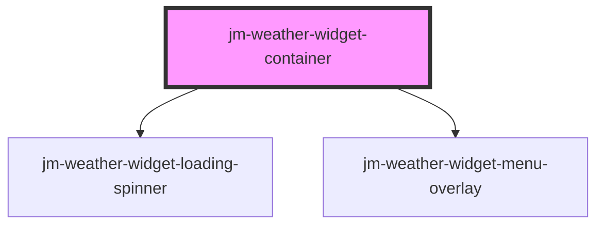

# jm-weather-widget-container

<!-- Auto Generated Below -->

## Properties

| Property       | Attribute       | Description | Type      | Default      |
| -------------- | --------------- | ----------- | --------- | ------------ |
| `apiKey`       | `api-key`       |             | `string`  | `undefined`  |
| `defaultCity`  | `default-city`  |             | `string`  | `'Portland'` |
| `defaultState` | `default-state` |             | `string`  | `'Oregon'`   |
| `drawerOpen`   | `drawer-open`   |             | `boolean` | `false`      |

## Dependencies

### Depends on

- [jm-weather-widget-loading-spinner](../jm-weather-widget-loading-spinner)
- [jm-weather-widget-menu-overlay](../jm-weather-widget-menu-overlay)

### Graph

----------------------------------------------

*Built with [StencilJS](https://stenciljs.com/)*
