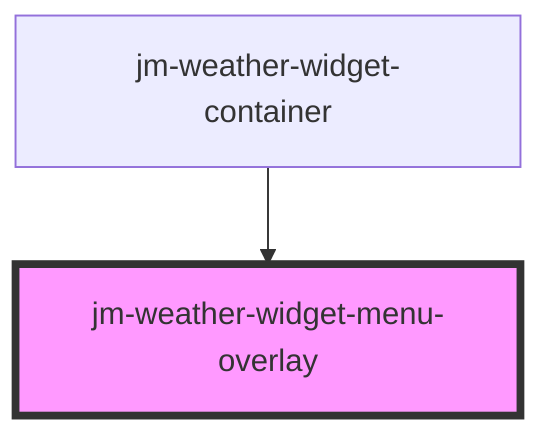

# jm-weather-widget-menu-overlay

<!-- Auto Generated Below -->

## Properties

| Property   | Attribute   | Description | Type      | Default |
| ---------- | ----------- | ----------- | --------- | ------- |
| `menuOpen` | `menu-open` |             | `boolean` | `false` |

## Events

| Event            | Description | Type                    |
| ---------------- | ----------- | ----------------------- |
| `jmFetchWeather` |             | `CustomEvent<string[]>` |

## Methods

### `open() => Promise<void>`

#### Returns

Type: `Promise<void>`

## Dependencies

### Used by

 - [jm-weather-widget-container](../jm-weather-widget-container)

### Graph

----------------------------------------------

*Built with [StencilJS](https://stenciljs.com/)*
